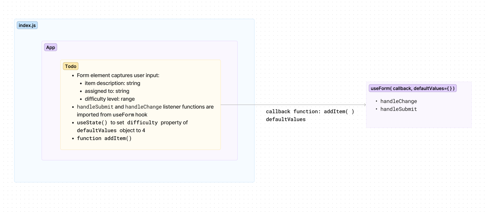

# Lab: Class 31 - To Do List Manager

- create UML after reading the code
  - starting from the code, work backwards

- reafactor to use Context
    - moving state to App
- use MAntine for styling.(80% of styling done today)

What isContext?

- a react hook that allows you to store values that can be requested at any child node of the component you create the context on (and wrap)
- context is a step in between state (local - useState) and a store or redux system (global state management)

How?

A Web Application for securely managing a To Do List.

## To Do List Manager Phase 1: Incorporate configuration settings to the application

Currently, a user can add todo tasks to the proof-of-life starter application. In this phase, we will:  

- add hard-wired, default context settings to the application so that the user can view three incomplete todo tasks.
- In addition, the user will have the option of viewing any additional incomplete tasks by using pagination functionality.

## Learning Outcomes

- Learn React context functionality and gain overall React fluency.
- Gain provicency in reading documentation by using a new component library.
- Practice JavaScript array manipulation by implementing pagination.
- Gain React testing fluency.

## Phase 1 Requirements

In Phase 1, we’re going to perform some refactoring of a Todo application built by another team. This application mixes application state and user settings at the top level and passes things around. It was a good proof of concept, but we need to make this production ready.

- Create a Detailed UML.
- Properly modularize the application into separate components, note the __proposed file structure__ below.
- Implement the Context API to make some basic application settings available to components.
  - Show three items by default.
  - Hide completed items by default.
  - Add the sort word ‘difficulty’ by default.
- Style the application using the [Mantine Component API](https://mantine.dev/pages/getting-started/){target:_blank}.
  - NOTE: The expectation to style this entire component in one day is likely unrealistic. The recommendation is to implement the required functionality, then systematically begin styling with Mantine. Match the comp image(s) as closely as possible. 80% of the design work will likely take 20% of your time. By the end of the week, being mostly there with style is the goal!

__Example:__
  

__Proposed File Structure:__

## Technical Requirements / Notes

_Create a settings Context component that can define how our components should display elements to the User._

__1. Implement the React `context` API for defining `settings` across the entire application.__

- Create React Context for managing application display settings and provide this at the application level.
- Add the following defaults to the context provider’s state, they will not be changeable in this lab.
  - Display three items.
  - Hide completed items using a boolean.
  - Define “difficulty” as a default sort word to optionally use in the stretch goal.

__2. Consume and utilize `context` values throughout your components.__

- Show a maximum of three items per screen by default in the `<List />` component.
- Use the Mantine `<Pagination />` component to allow users to navigate a list of items.
- Hide completed items in the list by default (the ability to show will be added in a later lab).

### Pagination Notes

- Only display the first `n` items in the list, where `n` is the default number three from your settings context.
  - If you have more than `n` items in the list, the `<Pagination />` component will add a button that, when clicked, will replace the list with the next `n` items in the list.
  - the `<Pagination />` component will manage the “previous” and “next” buttons upon correct implementation.
