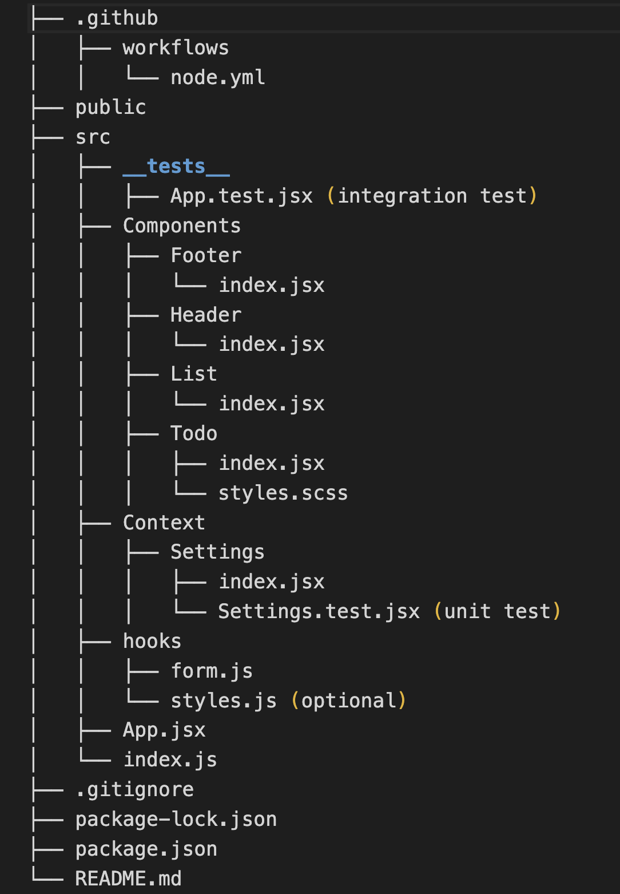

# Lab: Class 33 - `<Login />` and `<Auth />`

__To Do List Manager Phase 3:__ Adding security and access controls to the application.

## Phase 3 Requirements

<!-- In Phase 3, we’d like to extend the functionality of the application by requiring users be logged in to view items and also restrict access based on user type. The user stories from __Phases 1, and 2__ remain unchanged. For this phase, we are now adding the following new user stories. -->

<!-- - As a user, I want to provide a way for all users to login to their account.
- As a user, I want to make sure that my To Do items are only viewable to users that have logged in with a valid account.
- As a user, I want to ensure that only fellow users that are allowed to “create”, based on their user type, can add new To Do Items.
- As a user, I want to ensure that only fellow users that are allowed to “update”, based on their user type, can mark To Do Items complete.
- As a user, I want to ensure that only fellow users that are allowed to “delete”, based on their user type, can delete new To Do Items. -->

## Login/Auth Components and API

<!-- You have been provided, in the `starter-code` folder, a sample application built using the `<Login />` and `<Auth />` components built during class. Get this running first, and analyze it. You will need these components to complete the Authentication tasks specified above. -->

- Convert the `Auth/Context.js` Context Provider to be a function, rather than a class.
- Convert the `<Login />` and `<Auth />` components to be implemented as ‘function’ components instead of ‘class’ components.

Once you have a working practice app, extract the Login Context and relevant components from it and incorporate them into your To Do application, implementing Authentication and Authorization as described in the requirements above.

## Testing

- Write unit tests for the Login Context Component.
- Write unit tests for the Login/Auth components.
  - Hide/Show based on status.
- You will need to create some mocking interface to fake a server/login to simulate.
- Tests should assert all behavioral functionality.

--------------
<!-- # Lab: Class 32 - Context API - Behaviors

__To Do List Manager Phase 2:__ Incorporate configuration settings to the application.

## Phase 2 Requirements

- We will let the user make changes to 2 settings:

  - How many To Do Items to show at once.
  - Whether or not to show completed items.
  - Implement the Context API to make some basic application settings available to components.
- Provide the users with a form where they can change the values for those settings:
  - the form should be in a new component, linked from the main navigation
  - _Hint: Use Browser Router to create the page/route/component for this._
  - Once settings are updated, render the updated settings to the right of the “form”. Consider using `<Grid />`, `<Card />`, and `<When />` components.
- Save the users choices in Local Storage.
- Retrieve their preferences from Local Storage and apply them to the application on startup.

## Technical Requirements / Notes:

_Technical requirements for the core application are unchanged from the prior phases, with the addition of context behaviors defined in our global Context Provider._

1. Extend your `context` provider to include all of the following features:

- Create a `context` for managing application settings and provide this at the application level.
  - Display or Hide completed items (boolean).
  - Number of items to display per screen (number).
  - Default sort field (string).
  - Create a function in your context that saves user preferences (for the above) to local storage.
  - Implement a `useEffect()` (or `componentDidMount()`) in your context to read from local storage and set the values for those 2 state properties on application load.  
  _Note: You will need to `stringify()` your state prior to saving to local storage, and parse it when you retrieve it._

2. Consume and utilize Context values throughout your components:

- Show a maximum of a certain number of items per screen in the `<List />` component.
  - Properly implement the Mantine `<Pagination />` component functionality to let the users navigate a long list of items with the correct number of tasks showing per “page”.
- Hide or show completed items in the list.

## Testing

- Tests should assert all behavioral functionality.
- Do a deep mount of the app, and set tests to make assertions on the child components that consume context from the Provider.
  - Can they see context?

__Stretch Goal:__  

- Sort the items based on any of the keys (i.e. difficulty).
- Update the state handling for todo items to use `useReducer()` vs separate state management methods.

--------------

# Lab: Class 31 - To Do List Manager

A Web Application for securely managing a To Do List.

## Phase 1 Requirements

In Phase 1, we’re going to perform some refactoring of a Todo application built by another team. This application mixes application state and user settings at the top level and passes things around. It was a good proof of concept, but we need to make this production ready.

- Create a Detailed UML.

- Properly modularize the application into separate components, note the proposed file structure below.

- Implement the Context API to make some basic application settings available to components.

  - Show three items by default.

  - Hide completed items by default.

  - Add the sort word ‘difficulty’ by default.

- Style the application using the [Mantine Component API](https://mantine.dev/pages/getting-started/).

  - NOTE: The expectation to style this entire component in one day is likely unrealistic. The recommendation is to implement the required functionality, then systematically begin styling with Mantine. Match the comp image(s) as closely as possible. 80% of the design work will likely take 20% of your time. By the end of the week, being mostly there with style is the goal!

## UML

After refactor:

## Proposed File Structure

### What isContext?

- a react hook that allows you to store values that can be requested at any child node of the component you create the context on (and wrap)
- context is a step in between state (local - useState) and a store or redux system (global state management)

## Learning Outcomes

- Learn React context functionality and gain overall React fluency.
- Gain provicency in reading documentation by using a new component library.
- Practice JavaScript array manipulation by implementing pagination.
- Gain React testing fluency.

__Example:__
  

## Technical Requirements / Notes

_Create a settings Context component that can define how our components should display elements to the User._

__1. Implement the React `context` API for defining `settings` across the entire application.__

- Create React Context for managing application display settings and provide this at the application level.
- Add the following defaults to the context provider’s state, they will not be changeable in this lab.
  - Display three items.
  - Hide completed items using a boolean.
  - Define “difficulty” as a default sort word to optionally use in the stretch goal.

__2. Consume and utilize `context` values throughout your components.__

- Show a maximum of three items per screen by default in the `<List />` component.
- Use the Mantine `<Pagination />` component to allow users to navigate a list of items.
- Hide completed items in the list by default (the ability to show will be added in a later lab).

### Pagination Notes

- Only display the first `n` items in the list, where `n` is the default number three from your settings context.
  - If you have more than `n` items in the list, the `<Pagination />` component will add a button that, when clicked, will replace the list with the next `n` items in the list.
  - the `<Pagination />` component will manage the “previous” and “next” buttons upon correct implementation. -->
